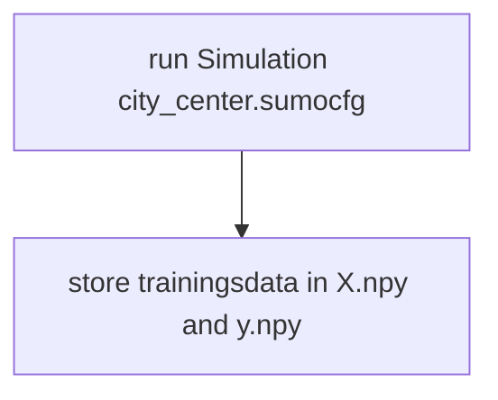
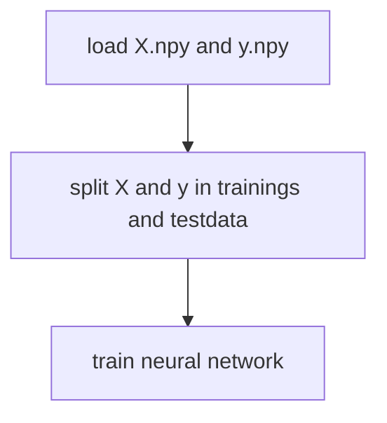
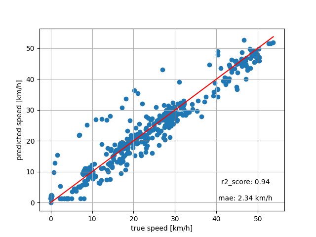
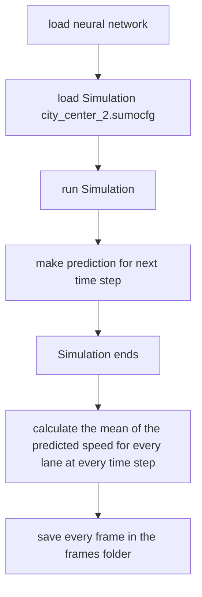
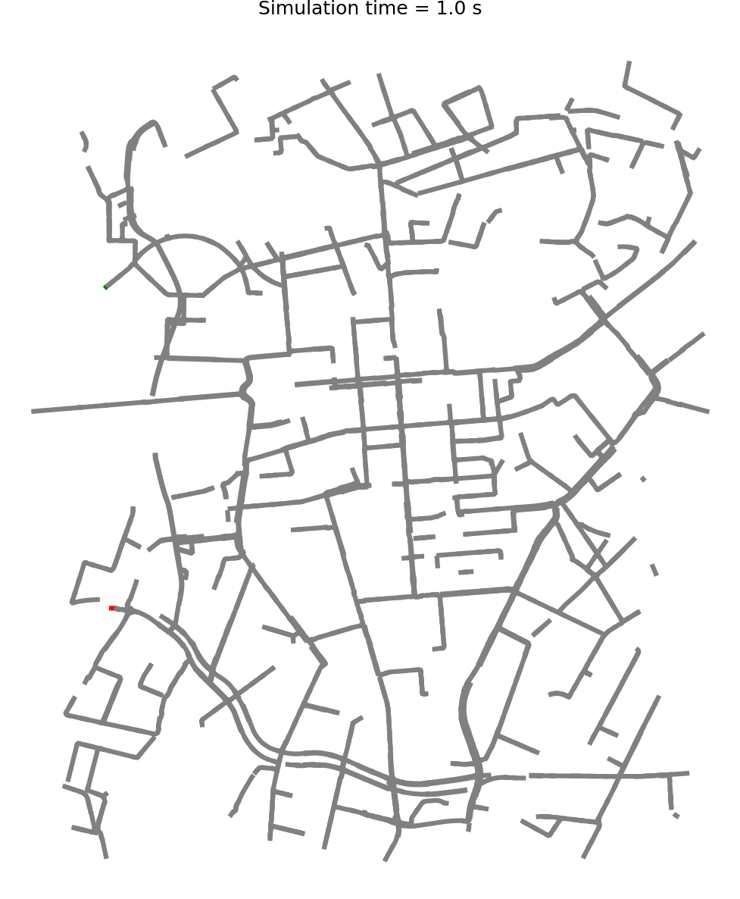

# Traffic Monitoring AI

This project loads a Sumo traffic simulation network and then trains a neural network that
predicts the speed of a vehicle in the next time step based on:
    - the speed of the vehicle in the current time step, 
    - the distance between the vehicle and the leading vehicle in the current time step
    - the speed of the leading vehicle in the current time step 

Then it colors the streets according to the predicted speed in the next time step

**code is private For code access or questions, please contact me at: tst1880@googlemail.com**

 
 
 

## Libraries used 
- traci
- numpy 
- pandas
- scikit-learn
- matplotlib

## Use Case

The goal is to explore whether simple ML models can anticipate short‑term traffic dynamics and support congestion analysis

This has significant potential for future data‑driven traffic management systems 

 
 
 

## Project Structure
- `get_data.py`: Running the sumo traffic simulation and gathering training data
- `training.py`: Script for training the neural network model
- `testing.py`: Script for evaluating model performance

 
 
 

### get_data.py

X is an array that contains:
- the speed of the vehicle in the current time step, 
- the distance between the vehicle and the leading vehicle in the current time step
- the speed of the leading vehicle in the current time step 

y is an array that contains:
- speed at the next time step 

 
 
 

### training.py

 
 
 

#### Results form training 

- R² = 0.94 — the model explains 94% of the variance in vehicle speeds, meaning it can predict speeds reliably across a wide range of traffic conditions.

- MAE = 2.34 km/h — the mean absolute error is low, indicating that the predicted speeds are very close to the actual speeds.

- Both metrics confirm the model’s accuracy, which is also visible in the scatter plot where most points lie close to the angle bisector (red line).

### testing.py 

 
 
 

## Results

- below is the result, the frames are converted to a gif

### Legend
- red: Neural Network predicts mean speeds below 10 km/h for the lane 
- yellow: Neural Network predicts mean speeds between 10 km/h and 20 km/h for the lane 
- green: Neural Network predicts mean speeds above 30 km/h for the lane 

